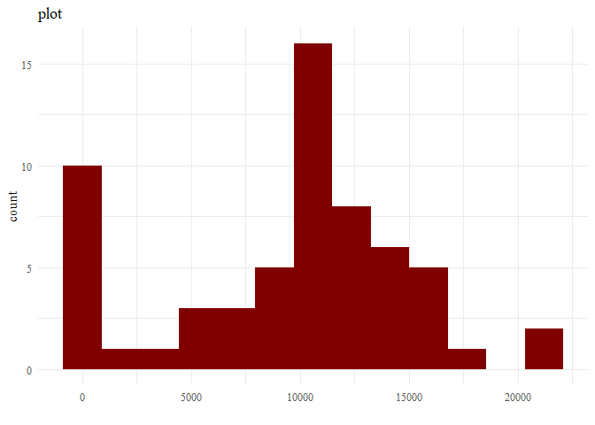
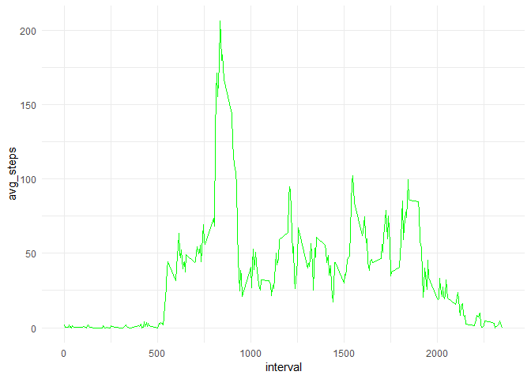
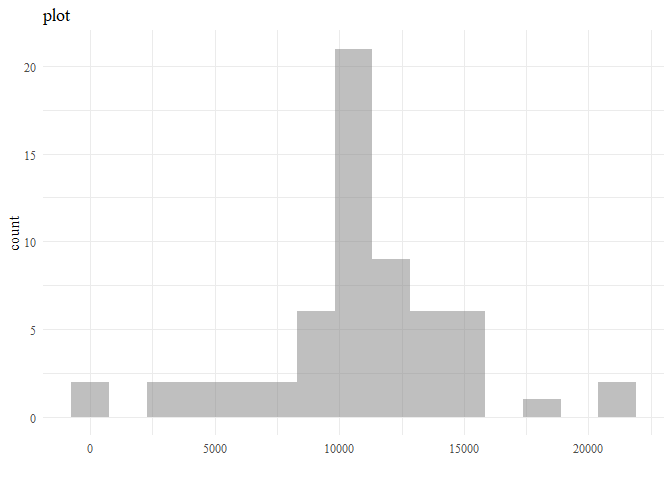
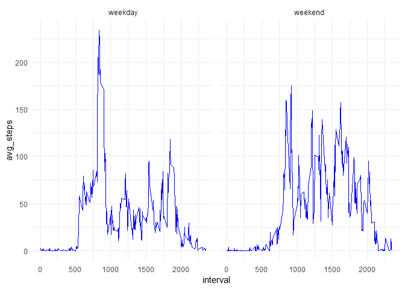

## Loading and preprocessing the data

```r
library(magrittr)
library(dplyr)
```

```
## 
## Attaching package: 'dplyr'
```

```
## The following objects are masked from 'package:stats':
## 
##     filter, lag
```

```
## The following objects are masked from 'package:base':
## 
##     intersect, setdiff, setequal, union
```

```r
library(ggplot2)
```

##Preprocessing


```r
# get_data: Get required data into a df
get_data <- function() {
  #data_url <- "https://d396qusza40orc.cloudfront.net/repdata%2Fdata%2Factivity.zip"
  #download.file(data_url, destfile = "~/Downloads/activity_monitoring_data.zip") # ???????????????
  #unzip("~/Downloads/activity_monitoring_data.zip", exdir = "~/Downloads/") # ?????????
  df <- read.csv("activity.csv", stringsAsFactors = FALSE)
  df$date <- as.Date(df$date)
  return(df)
}
df <- get_data()
```

## What is mean total number of steps taken per day?
##Total no. of steps


```r
summarized_df <- df %>%
  group_by(date) %>%
  summarise(ttl_steps = sum(steps, na.rm = TRUE))
summarized_df
```

```
## # A tibble: 61 x 2
##    date       ttl_steps
##    <date>         <int>
##  1 2012-10-01         0
##  2 2012-10-02       126
##  3 2012-10-03     11352
##  4 2012-10-04     12116
##  5 2012-10-05     13294
##  6 2012-10-06     15420
##  7 2012-10-07     11015
##  8 2012-10-08         0
##  9 2012-10-09     12811
## 10 2012-10-10      9900
## # ... with 51 more rows
```
##histogram

```r
ggplot(summarized_df, aes(x = ttl_steps)) +
  geom_histogram(bins = 13, fill = rgb(0.5, 0, 0, 1)) +
  xlab("") +
  ggtitle("plot") +
  theme_minimal() +
  theme(text = element_text(family = "serif"))
```

<!-- -->

##mean and median 

```r
mean_ttl_steps <- mean(summarized_df$ttl_steps)
median_ttl_steps <- median(summarized_df$ttl_steps)
mean_ttl_steps
```

```
## [1] 9354.23
```

```r
median_ttl_steps
```

```
## [1] 10395
```


## What is the average daily activity pattern?
##time series plot

```r
summarized_df <- df %>%
  group_by(interval) %>%
  summarise(avg_steps = mean(steps, na.rm = TRUE))

ggplot(summarized_df, aes(x = interval, y = avg_steps)) +
  geom_line(color = "green") +
  theme_minimal()
```

<!-- -->

##max steps

```r
max_steps <- max(summarized_df$avg_steps)
summarized_df %>%
  filter(avg_steps == max_steps)
```

```
## # A tibble: 1 x 2
##   interval avg_steps
##      <int>     <dbl>
## 1      835      206.
```


## Imputing missing values
##total values

```r
is_complete <- complete.cases(df)
sum(!is_complete)
```

```
## [1] 2304
```

##mean for 5 min

```r
interval_avg <- df %>%
  group_by(interval) %>%
  summarise(avg_steps = mean(steps, na.rm = TRUE))
```
##filled dataset

```r
df_imputed <- df
for (i in 1:nrow(df_imputed)) {
  if (is.na(df_imputed[i, "steps"]) == TRUE) {
    data_interval <- df_imputed[i, "interval"]
    imputed_value <- interval_avg[interval_avg$interval == data_interval, "avg_steps"]
    df_imputed[i, "steps"] <- imputed_value
  } else {
    df_imputed[i, "steps"] <- df_imputed[i, "steps"]
  }
}
```
##plot

```r
summarized_df <- df_imputed %>%
  group_by(date) %>%
  summarise(ttl_steps = sum(steps, na.rm = TRUE))

ggplot(summarized_df, aes(x = ttl_steps)) +
  geom_histogram(bins = 15, fill = rgb(0.5, 0.5, 0.5, 0.5)) +
  xlab("") +
  ggtitle("plot") +
  theme_minimal() +
  theme(text = element_text(family = "serif"))
```

<!-- -->


```r
mean_ttl_steps <- mean(summarized_df$ttl_steps)
median_ttl_steps <- median(summarized_df$ttl_steps)
mean_ttl_steps
```

```
## [1] 10766.19
```

```r
median_ttl_steps
```

```
## [1] 10766.19
```


## Are there differences in activity patterns between weekdays and weekends?

```r
df$weekday_indicator <- ifelse(weekdays(df$date) %in% c("Saturday", "Sunday"), "weekend", "weekday")

summarized_df <- df %>%
  group_by(interval, weekday_indicator) %>%
  summarise(avg_steps = mean(steps, na.rm = TRUE))

ggplot(summarized_df, aes(x = interval, y = avg_steps)) +
  geom_line(color = "blue") +
  facet_wrap(~weekday_indicator) +
  theme_minimal()
```

<!-- -->

